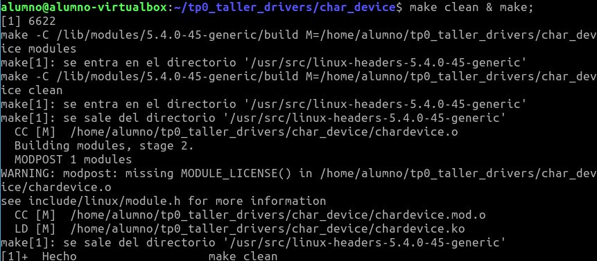
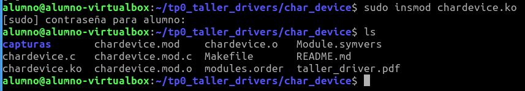
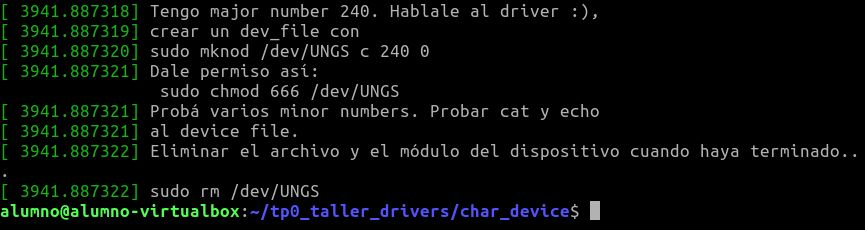
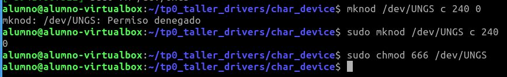
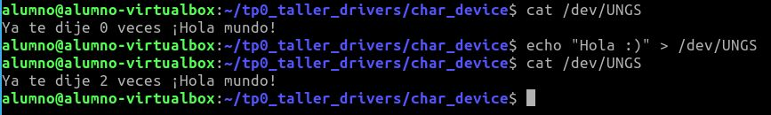
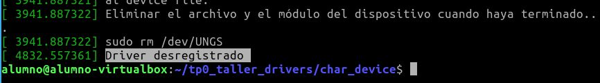

# Trabajo Practico Inicial de Sistemas Operativos y Redes II
## Device Drivers - Char Device
## Introducción
Para la realización de este TP se creo un modulo de kernel para un char device que haga encriptación cesar


## Pasos

* Ejecutar ```make clean & make``` compilar el modulo


* Insertar el modulo ```sudo insmod michardevice.ko``` 


* ver el log de kernel con el comando ```dmesg``` para ver que el modulo fue insertado de manera correcta. 


* Creamos el archivo como se explico en el log utilizando ```sudo mknod``` y le habilitamos todos los permisos con ```chmod 666``` para no tener problemas de escritura.


* Hacemos un ```echo``` al char device en ```/dev/miCharDevice``` para pasarle la cadena de texto a encriptar. Y luego hacemos un ```cat``` sobre el char device para ver el resultado.


* Eliminamos el modulo con ```sudo rmmod miChardDevice.ko```. Vemos el log con ```dmesg```



