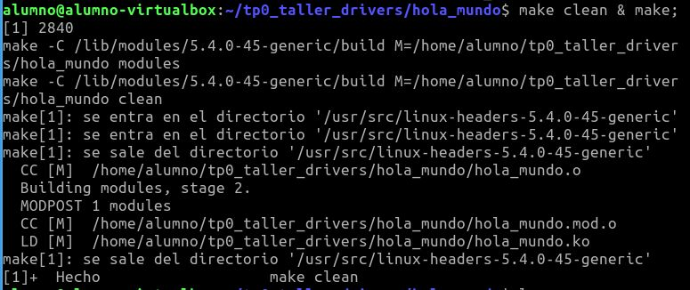
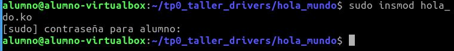
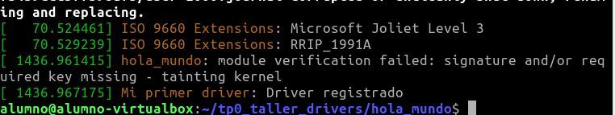
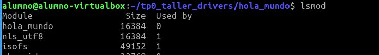
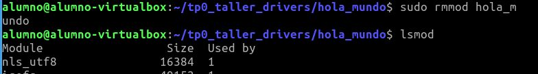

# TP0 DRIVERS - SOR2

## Introducción
Para este TP se crea un modulo básico de ejemplo.

## Pasos a seguir

* Ejecutar ```make clean & make``` para compilar el modulo


* Insertar el modulo con ```sudo insmod hola_mundo.ko```


* Ver el log de kernel con el comando ```dmesg```


* Para ver el listado de modulos ```lsmod```


* Eliminar el modulo con ```sudo rmmod hola_mundo.ko```


* Ver el log de kernel con el comando ```dmesg``` El modulo se elimino de forma correcta

